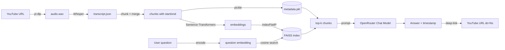

# 🎙️ Podcast Q&A Bot

An AI-powered chatbot that lets you ask natural-language questions about the podcast

> **Elon Musk × Nikhil Kamath | People by WTF Ep. 16**

The bot:

1. Accepts free-form questions from the user.
2. Searches the full podcast transcript with **semantic search** (embeddings + FAISS).
3. Generates a concise answer with an **LLM** that is restricted to the retrieved context.
4. Returns the **exact timestamp** of the relevant segment.
5. Provides a **clickable YouTube URL** that starts playback at that timestamp.
6. Shows the **raw transcript segment** used as evidence.

---

## 📑 Table of contents

- [Architecture](#-architecture)
- [Folder structure](#-folder-structure)
- [Installation](#-installation)
- [Running locally](#-running-locally)
- [How the RAG pipeline works](#-how-the-rag-pipeline-works)
- [How timestamps are preserved](#-how-timestamps-are-preserved)
- [Accuracy verification methodology](#-accuracy-verification-methodology)
- [Limitations](#-limitations)
- [Possible improvements](#-possible-improvements)

---

## 🏛 Architecture



End-to-end the system is a classic **Retrieval-Augmented Generation (RAG)** pipeline, with retrieval backed by dense vector search and generation by a chat-completion model.

---

## 📁 Folder structure

```
podcast_qa_bot/
│
├── data/
│   ├── audio/                # downloaded .wav files
│   └── transcript/           # transcript.json
│
├── embeddings/               # faiss.index + metadata.pkl
│
├── app.py                    # Streamlit frontend
├── transcribe.py             # YouTube → audio → transcript
├── embed.py                  # chunks → embeddings → FAISS
├── chatbot.py                # RAG pipeline (retrieval + LLM)
├── config.py                 # env-driven configuration
├── utils.py                  # timestamp + YouTube helpers
│
├── requirements.txt
├── .env.example
├── .gitignore
└── README.md
```

---

## 🛠 Installation

> Tested on **Python 3.11+**. A CUDA-capable GPU is optional but recommended for faster Whisper inference.

### 1. Clone / enter the project

```bash
cd podcast_qa_bot
```

### 2. Create a virtual environment

```bash
python -m venv .venv
# Windows
.venv\Scripts\activate
# macOS / Linux
source .venv/bin/activate
```

### 3. Install Python dependencies

```bash
pip install --upgrade pip
pip install -r requirements.txt
```

### 4. Install `ffmpeg` (required by Whisper and yt-dlp)

| OS       | Command                                                                                       |
| -------- | --------------------------------------------------------------------------------------------- |
| Windows  | `choco install ffmpeg`  *or* download a static build from [gyan.dev](https://www.gyan.dev/ffmpeg/builds/) and add `bin/` to `PATH` |
| macOS    | `brew install ffmpeg`                                                                         |
| Ubuntu   | `sudo apt-get install ffmpeg`                                                                 |

Verify with:

```bash
ffmpeg -version
```

### 5. Configure environment

```bash
cp .env.example .env
# then edit .env and set OPENROUTER_API_KEY
```

This project uses **[OpenRouter](https://openrouter.ai/)** (an OpenAI-compatible
gateway that gives access to many LLMs, including **free** models).

1. Sign up at <https://openrouter.ai/> and create an API key at <https://openrouter.ai/keys>.
2. Put the key (`sk-or-v1-...`) in `.env` as `OPENROUTER_API_KEY`.
3. Pick a model in `.env` via `LLM_MODEL`. The default is
   `meta-llama/llama-3.3-70b-instruct:free` — a strong, free option.
   Browse the full list at <https://openrouter.ai/models> (filter by `:free`).
   Other good free picks:
   - `meta-llama/llama-3.1-8b-instruct:free`
   - `qwen/qwen-2.5-72b-instruct:free`
   - `google/gemini-2.0-flash-exp:free`

> Free models have rate limits (≈20 req/min, 50/day per model). The bot still
> works — it just throttles. If you start hitting limits, switch to a paid
> model such as `openai/gpt-4o-mini` or `anthropic/claude-3.5-haiku`.

You can also override `YOUTUBE_URL` in `.env` to point at a different episode.

---

## ▶ Running locally

The pipeline has three one-off steps followed by an interactive UI:

```bash
# 1. Download audio and transcribe with Whisper
python transcribe.py

# 2. Build the FAISS index
python embed.py

# 3. Launch the Streamlit app
streamlit run app.py
```

You can also ask a single question from the command line:

```bash
python chatbot.py "What is first-principles thinking?"
```

---

## 🔄 How the RAG pipeline works

| Step | File            | What happens                                                                                          |
| ---- | --------------- | ----------------------------------------------------------------------------------------------------- |
| 1    | `transcribe.py` | `yt-dlp` downloads the audio, `Whisper` transcribes it, segments with `start / end` are written to JSON. |
| 2    | `embed.py`      | Adjacent segments are merged into ~800-char chunks (timestamps preserved). Each chunk is embedded with `sentence-transformers/all-MiniLM-L6-v2` and added to a `faiss.IndexFlatIP` index. |
| 3    | `chatbot.py`    | The question is embedded with the same model. FAISS returns the top-k chunks. They are concatenated into a context block and sent to an OpenRouter chat model (OpenAI-compatible API) with a strict "answer from context only" system prompt. |
| 4    | `app.py`        | Streamlit renders the answer, the timestamp, the transcript segment, and an "Open Video at this moment" button that points to `https://www.youtube.com/watch?v=VIDEO_ID&t=Ns`. |

### Why this design?

* **Whisper** produces reliable segment-level timestamps out of the box, so we never need a forced-alignment step.
* **Sentence-Transformers** + **FAISS** is a lightweight, fully local retrieval stack (no Pinecone / Weaviate required).
* **OpenRouter chat models** (OpenAI-compatible) are easy to swap — just change `LLM_MODEL` in `.env`. The strict system prompt is a cheap but effective hallucination guard.

---

## ⏱ How timestamps are preserved

Timestamps are the link between the answer and the YouTube video. We preserve them at every stage:

1. **Whisper** returns `start` and `end` (in seconds) for every segment.
2. **`embed.build_chunks`** records the **earliest** `start` and the **latest** `end` of the segments that were merged into a chunk, so the chunk still represents a contiguous span of audio.
3. **`chatbot.PodcastQA.ask`** uses the `start` of the best-scoring chunk to build the YouTube deep-link:

   ```python
   f"https://www.youtube.com/watch?v={video_id}&t={int(seconds)}s"
   ```

4. **`utils.format_timestamp`** formats the same number of seconds as `HH:MM:SS` (or `MM:SS` for short clips) for display.

The `transcript.json` file is the single source of truth for timestamps and is human-readable.

---

## ✅ Accuracy verification methodology

A production RAG system should be evaluated on two things: **retrieval quality** and **answer quality**.

### Retrieval quality

| Metric              | How to compute                                                                |
| ------------------- | ----------------------------------------------------------------------------- |
| **Recall@k**        | For each gold-standard Q&A, check whether the answer's timestamp is in the top-k retrieved chunks. |
| **MRR**             | Mean reciprocal rank of the first relevant chunk for each question.          |
| **Embedding sanity**| Manually inspect 10–20 queries and confirm the top chunk is on-topic.         |

Build a small `eval.jsonl` of `{"question": ..., "gold_timestamp": ..., "gold_answer": ...}` and write a small script that iterates through it, calling `qa.retrieve(question)` for each entry.

### Answer quality

| Method                     | Description                                                                                    |
| -------------------------- | ---------------------------------------------------------------------------------------------- |
| **LLM-as-judge**           | Ask GPT-4 to grade each answer as *correct / partially correct / incorrect / hallucinated*.    |
| **Human rubric**           | 3 reviewers score answers on a 1–5 scale for *faithfulness*, *relevance*, and *conciseness*.   |
| **Faithfulness check**     | Compute the fraction of answer tokens that appear in the retrieved context (rough proxy).      |
| **Latency**                | Measure end-to-end and per-stage latency (embedding, FAISS search, LLM call).                  |

### Suggested pass criteria

* ≥ 80 % of answers marked *correct* by the LLM-as-judge on a 30-question eval set.
* ≥ 75 % Recall@4 on retrieval.
* p95 latency < 5 s with `gpt-3.5-turbo` on a 90-min podcast.

---

## ⚠️ Limitations

* **Whisper errors** – background music, cross-talk, and accented English can produce mis-transcriptions that propagate downstream.
* **Speaker attribution** – we do not run diarisation, so the LLM sometimes says "Elon says…" even though the line may have been spoken by Nikhil. WhisperX + `pyannote-audio` would fix this.
* **Single-episode scope** – the index covers exactly one podcast. Multi-episode support would need a per-episode index and metadata-aware routing.
* **English-only** – the LLM and embeddings are tuned for English; other languages will degrade.
* **LLM hallucination** – the system prompt is *good but not perfect*. Always verify the timestamp and the transcript segment before trusting an answer.
* **Chunk boundaries** – merging by character count can split a single thought across two chunks. Semantic or sentence-window chunking would help.
* **No memory** – each question is answered independently. Multi-turn chat would need a conversation buffer.
* **Token cost** – every question costs an OpenRouter call. The free tier covers light usage, but high-traffic use may need a paid model or a self-hosted open-source LLM (e.g. Llama 3, Mistral) served via `Ollama` or `vLLM`.

---

## 🚀 Possible improvements

* **WhisperX** for word-level timestamps and speaker diarisation.
* **Semantic chunking** (split on embeddings / topic shifts) instead of fixed-character chunks.
* **Cross-encoder re-ranking** (e.g. `cross-encoder/ms-marco-MiniLM-L-6-v2`) on the top-50 FAISS hits before sending to the LLM.
* **Hybrid retrieval** (BM25 + dense) for better recall on rare terms and proper nouns.
* **Streaming responses** in the Streamlit UI with `st.write_stream`.
* **Chat history** stored in `st.session_state` for follow-up questions.
* **Highlight the source sentence** in the transcript card instead of dumping the whole chunk.
* **Multi-episode support** with a `source` field on every chunk.
* **Evaluation harness** (`eval/`) with the metrics described above.
* **Containerisation** with a `Dockerfile` and a `docker-compose.yml` that bundles ffmpeg.
* **Use an open-source LLM** (Llama 3, Mistral, Qwen) via `Ollama` or `vLLM` to remove the OpenAI dependency. (OpenRouter already exposes many of these, so this is mostly relevant for fully-offline use.)
